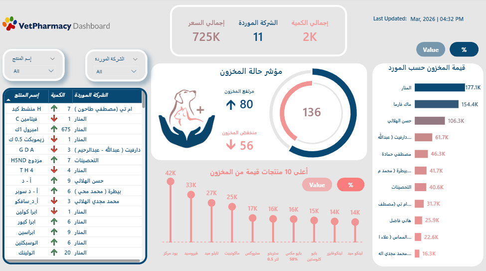

🐾 Vet Pharmacy Inventory Dashboard

---

# 📊 Overview
This project analyzes veterinary pharmacy inventory performance using Power BI to monitor stock levels, supplier contribution, and product movement.

The dashboard helps identify inventory trends, supplier performance, and operational issues affecting stock availability and inventory value.

---

## 🎯 Objective
- Monitor inventory status and stock movement
- Analyze supplier contribution to inventory value
- Track high-value products
- Identify operational performance issues
- Improve inventory visibility and decision-making

---

## 📌 Key KPIs
- Total Inventory Quantity
- Total Inventory Value
- Number of Suppliers
- High Stock Products
- Low Stock Products

---

## 📊 Key Insights
- A small number of suppliers contribute the highest inventory value.
- Several products show low stock levels and may require restocking.
- High-value inventory is concentrated in specific product categories.
- Inventory distribution varies significantly across suppliers.
- Monitoring stock status helps detect operational inefficiencies early.

---

## 📌 Key Features
- Interactive inventory status monitoring
- Supplier contribution analysis
- Top 10 products by inventory value
- Dynamic value and percentage view toggle
- Detailed inventory table with stock movement indicators
- KPI cards for inventory tracking
- Visual analysis for supplier performance

---

## 💡 Recommendations
- Restock low inventory products proactively.
- Diversify suppliers to reduce dependency risks.
- Monitor high-value products closely to optimize inventory costs.
- Implement inventory alerts for critical stock levels.
- Use supplier performance analysis to improve purchasing decisions.

---

## 🛠️ Tools Used
- Power BI
- Data Visualization
- DAX

---

## 🔗 Project Sharing

👉 LinkedIn Case Study: (https://www.linkedin.com/posts/aml-ghazy-b1a50b3a4_dataanalytics-businessintelligence-dashboarddesign-share-7434313367017742337-FXJB?utm_source=share&utm_medium=member_desktop&rcm=ACoAAGMIDIYBHodAL2wtNlFwkDPUWM0DzigmRgk)
